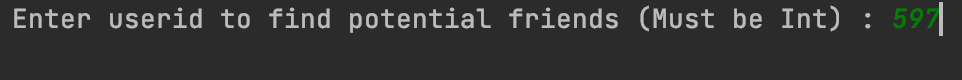
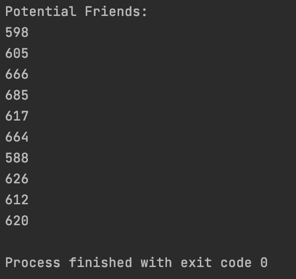

# Finding Potential Friends via Link Prediction
This is a Spark Scala project to perform simple link prediction on nodes of a social network graph.

## How to use
The simple command line program is very easy to use. First, build and run the project (best in IntelliJ). An initial prompt will ask for the userid who you would like to find potential friends for:
 
 

The output will be a list of ten userids as potential friends:
 
 

